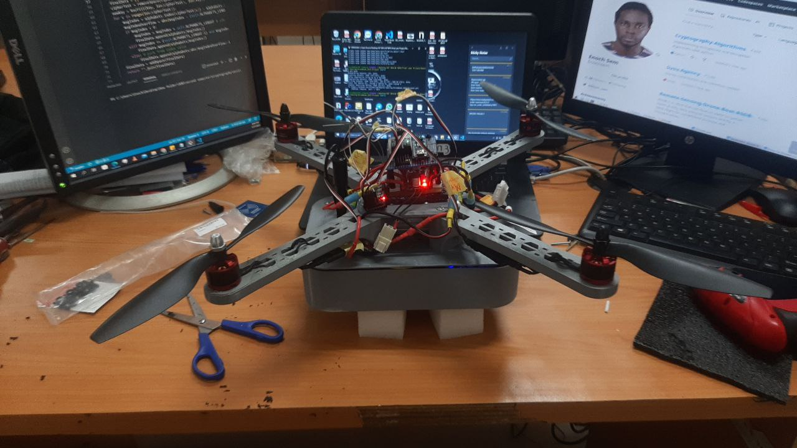
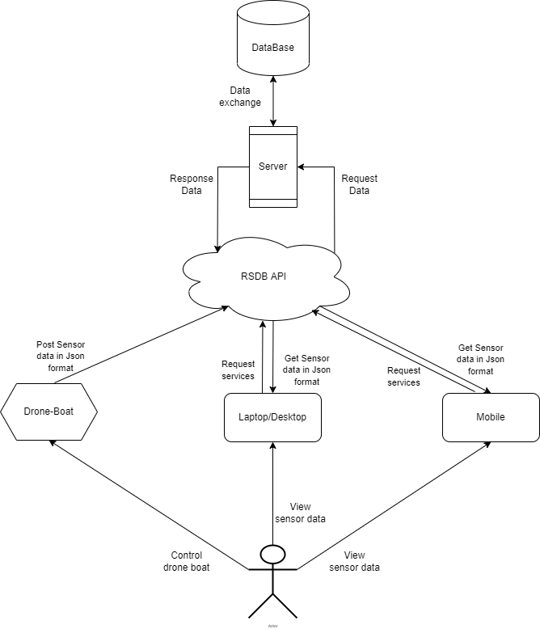
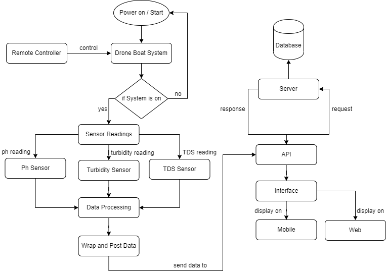
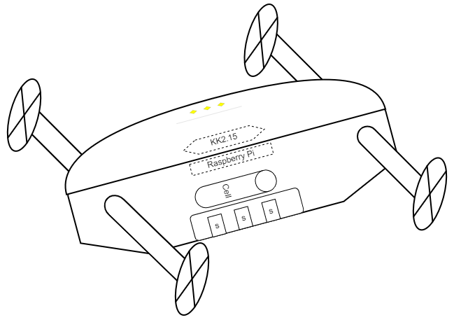
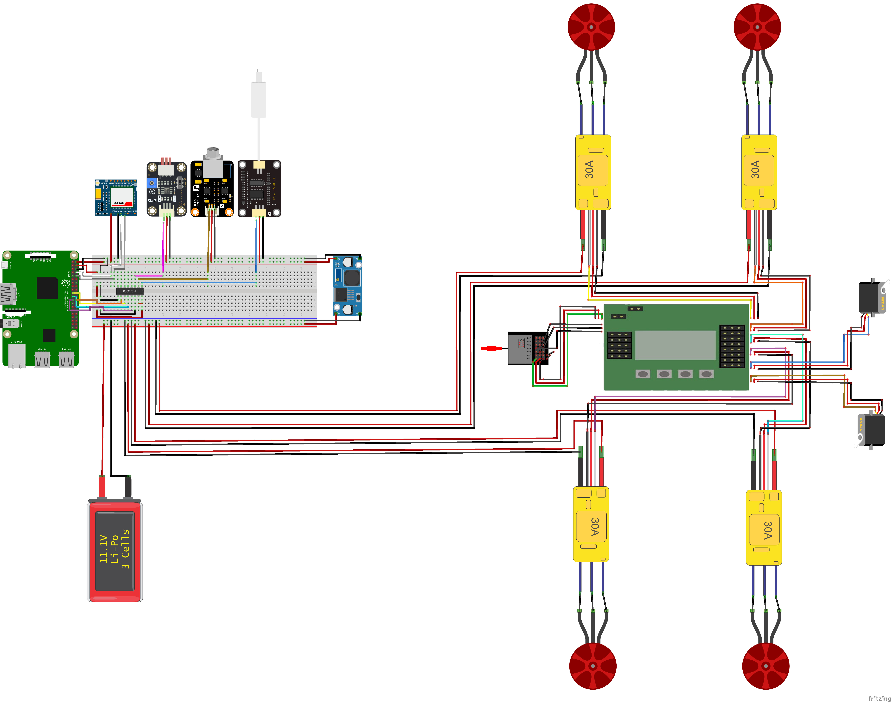
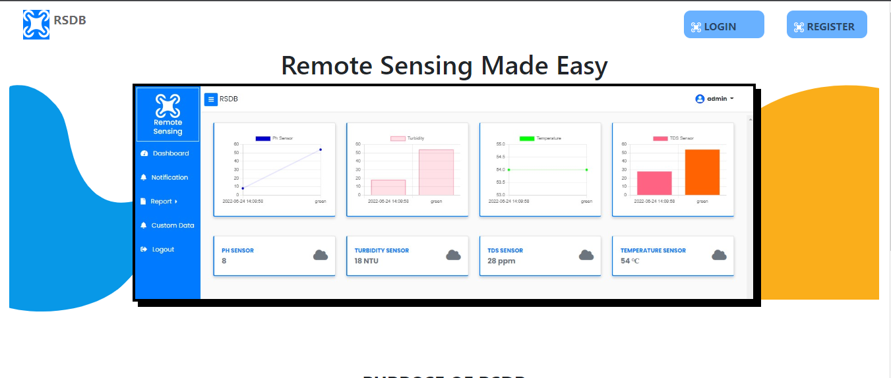
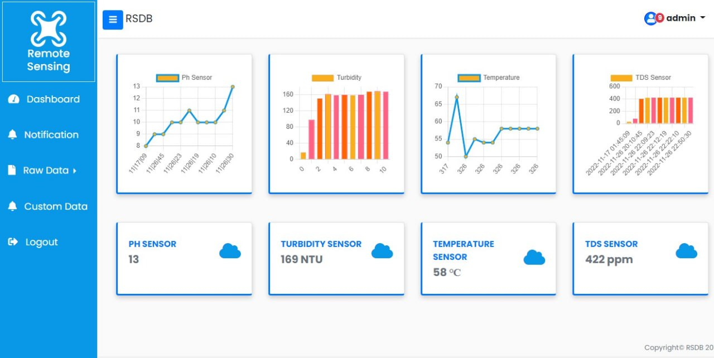

# Remote-Sensing-Drone-Boat-RSDB-

RSDB is an IOT based syytem that can float on water to gather water quality data using its sensors and fly, it is equipped with sensor and actuators that make it able to perceive it environment and act on them. 

#Add all documentation to projects 

#Statement of Problem
Current water quality monitoring systems analyze the parameters individually and are expensive. To measure water quality, 
devices must be manually placed in the water body. Water quality measurement is difficult to gather over large bodies of water in a short amount of time, 
and hence makes the scope of water quality monitoring limited. 

## Research Questions
i.	Is the scope of water quality monitoring limited?
ii.	Will the designed system be able to fly and float on water?
iii.	How accurate are the measurements of the system?
iv.	What form of communication will exist between devices?
v.	How will end users access the parameters measured?

## Purpose of the Project
Making water quality monitoring easier by decreasing manual testing and assessment of water.
To help researchers and fishermen be able to measure water quality and also monitor and pridict 
the migration patterns of aquatic life on larger bodies of water.

## Significance of Project
The system is meant to take different parameter readings and display them all on a graphical user interface 
to save time used in manually calculating every parameter reading needed. 
The study also provides easier mobility and remote sensing, an upgrade from the water quality monitoring systems currently in use.

## Objectives
The objective of this study is:
•	To measure some physicochemical properties of water - pH, turbidity, temperature, electrical conductivity of water
•	To provide real-time analysis of the sensor data and visualization.
•	To build a system that can transport and collect data efficiently by means of air or water.
•	To design a mobile and low-cost water quality checker.
•	To be able to carry out water quality analysis at remote locations. 
•	To eradicate errors and accidents that take place when the data is collected manually.

## System Design
The system design assists in designing the overall system architecture as well as describing hardware and system requirements needed to produce the results. Hardware designs, use case diagrams, sequence diagrams, transition diagrams, and prototypes are among the deliverables created at this stage.

Figure 3 : General System Design
<!--  --> 
 

### Flowchart
A flowchart is a diagram that depicts the steps in a process. It began as a tool for describing algorithms and programming logic, but it has now been expanded to encompass a wide range of operations. Flowcharts are now widely used for showing data and supporting reasoning. They aid in the visualization of complex processes and the clarification of the structure of problems and activities. A flowchart can also be used to define a process or project that needs to be carried out. Here's a diagram of how the system should work after it's finished.

Figure 4 : System Flowchart
<!--  --> 
  
 
### The Hardware Design
This is the system's actual design. It is the physical component that users can see and feel. The system's hardware design is depicted in the diagram below.
 
Figure 5 : Hardware Design 
<!--  -->

 

### Electronic Circuit Design 
The tools used to design and verify integrated circuits (ICs), printed circuit boards, and other electronic devices are referred to as electronic design automation (EDA). Electronic systems in general, as well as printed circuit boards (PCBs).

Fritzin Diagram
<!--  -->

## Building the front end
	The user can view real-time sensor readings on the front end. Data from the system can also be downloaded by the user. The user must first create an account using his or her device ID in order to log in. The username and password used during registration can then be used to log into the system.

RSDB Homepage

RSDB Dashboard
